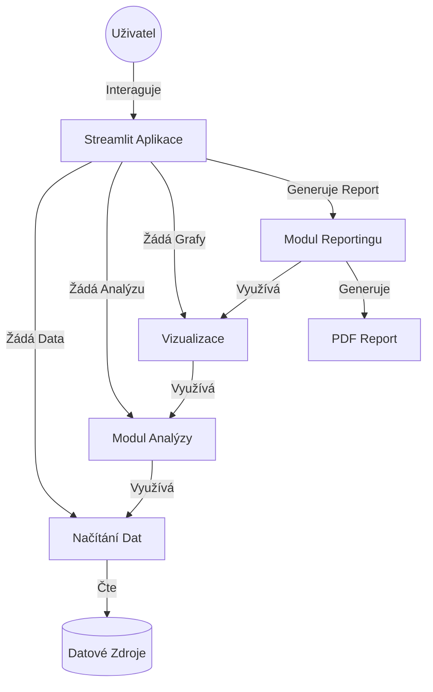

# fveAnalyzatorpro Analýzu FVE

## Popis
Tento nástroj poskytuje hloubkovou analýzu proveditelnosti realizace fotovoltaické elektrárny (FVE) pro zákazníky Antelon Energy. Porovnává investici do FVE se současným stavem a jinými investičními příležitostmi (např. S&P 500).

## Funkce
- **Analýza toků energie**: Analýza spotřeby, výroby, využití baterie a interakce se sítí.
- **Ekonomická analýza**: Výpočet ROI, NPV a porovnání s jinými investicemi.
- **Vizualizace**: Interaktivní grafy pomocí Plotly.
- **PDF Reporting**: Generování komplexních PDF reportů s grafy, tabulkami a shrnutím analýzy.
- **Plánování scénářů**: Optimalizace velikosti FVE a baterie.

## Technologie
- **Jazyk**: Python 3.12+
- **Frontend**: Streamlit
- **Zpracování dat**: Pandas, NumPy
- **Vizualizace**: Plotly, Kaleido
- **Reporting**: WeasyPrint, Jinja2
- **Kontejnerizace**: Docker

## Instalace

### Lokální vývoj
1. Naklonujte repozitář.
2. Vytvořte virtuální prostředí:
   ```bash
   python3 -m venv venv
   source venv/bin/activate
   ```
3. Nainstalujte závislosti:
   ```bash
   pip install -r requirements.txt
   ```
4. Spusťte aplikaci:
   ```bash
   streamlit run src/app.py
   ```

### Docker
1. Sestavte a spusťte kontejner:
   ```bash
   docker compose up --build
   ```
2. Aplikace je dostupná na `http://localhost:8501`.

## Komunikační Matice


