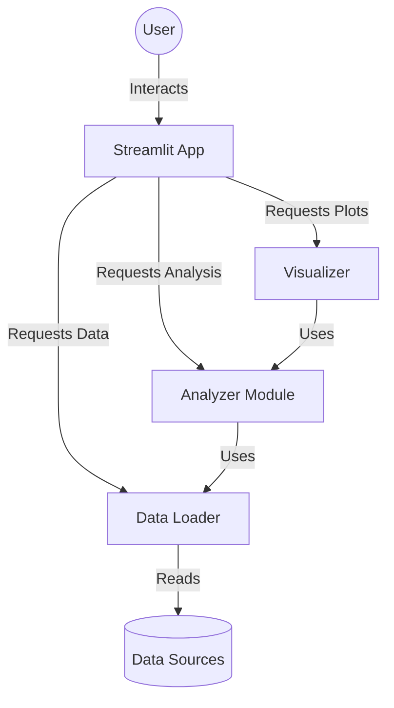

# fveAnalyzator

## Description
This tool provides a deep analysis of the feasibility of implementing a Photovoltaic (PV) power plant for Antelon Energy customers. It compares the investment in a PV system against the current state and other investment opportunities (e.g., S&P 500).

## Features
- **Energy Flow Analysis**: Analyzes consumption, production, battery usage, and grid interaction.
- **Economic Analysis**: Calculates ROI, NPV, and compares with other investments.
- **Visualization**: Interactive charts using Plotly.
- **Scenario Planning**: Optimizes PV and battery size.

## Technology Stack
- **Language**: Python 3.12+
- **Frontend**: Streamlit
- **Data Processing**: Pandas, NumPy
- **Visualization**: Plotly
- **Containerization**: Docker

## Installation

### Local Development
1. Clone the repository.
2. Create a virtual environment:
   ```bash
   python3 -m venv venv
   source venv/bin/activate
   ```
3. Install dependencies:
   ```bash
   pip install -r requirements.txt
   ```
4. Run the application:
   ```bash
   streamlit run src/app.py
   ```

### Docker
1. Build and run the container:
   ```bash
   docker compose up --build
   ```
2. Access the app at `http://localhost:8501`.

## Communication Matrix


